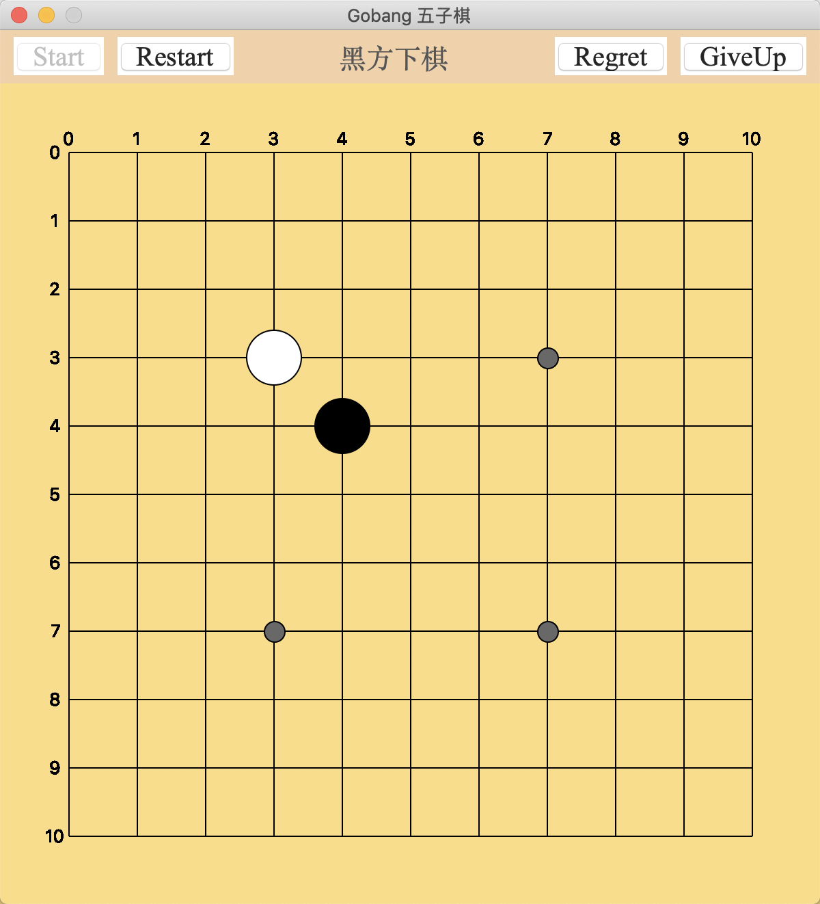

## Gobang Based on Monte Carlo Tree Search
> Author: cnarutox
> Lanuage: Python
> Platform: MacOS, Windows, Linux



<span id = "gobang"></span>

#### [gobang.py](#gobang.py)
> 程序启动的入口
- `Game`类管控游戏的启动，重启，悔棋与认输
  - 成员变量`board`对应**Board.py**中的棋盘类
  - 成员变量`player`取值为-1(**玩家**)与1(**电脑**)
  - 成员变量`previous`为存储上一步走法的列表(最多两个元素：**玩家**与**电脑**)
  - 成员变量`queue`为存储**mcts.py**搜索结果的队列
  - 成员函数`waiting`负责从队列**queue**中获得搜索结果
    - 若**queue**为空则说明搜索未完成，需再次尝试获得
    - 若在等待过程中玩家选择`regret`(悔棋)，`previous`会被清空，此时程序会在拿到搜索结果后放弃该结果
  - 成员函数`click`为界面的绑定触发函数
    - 玩家(**黑棋**)出棋后会有另外一个进程去执行`mcts`函数
    - `after`函数可以延迟指定时间(**100ms**)去执行`waiting`函数，防止阻塞负责渲染UI的主进程

<span id = "Board"></span>

#### [Board.py](#Board.py)
> 控制棋盘的类
- `Board`类控制棋子的移动、搜索时判断棋局是否结束以及防御玩家的进攻
  - 成员函数`move`负责移动棋子
  - 成员函数`update`负责获得棋盘上的空闲位置
  - 成员函数`end`负责判断当前棋局胜负情况
  - 成员函数`defend`负责判断当前棋局胜负情况
    - 如果对方已有四子连珠，优先围堵该处

<span id = "Node"></span>

#### [Node.py](#Node.py)
> MCTS中的结点类
- 成员函数`succ_fail`负责搜索过程中的回溯更新结点

<span id = "mcts"></span>

#### [mcts.py](#mcts.py)
> 控制Monte Carlo Tree Search的一组函数
- 函数`selection`负责使用**UCB算法**选择最优结点
- 函数`expansion`负责随机选择一个子结点去扩展
- 函数`stimulation`负责模拟棋局的胜负
- 函数`backdate`负责回溯更新整个搜索树
- 函数`intervene`负责回溯更新整个搜索树人为干预搜索结果，如有下一步必输的局面优先执行
- 函数`mcts`负责搜索过程的全过程，搜索结果会放入队列，等待主进程获取结果并去渲染
#### Pylint 静态分析结果
##### Statistics by type
| type     | number | old number | difference | %documented | %badname |
| -------- | ------ | ---------- | ---------- | ----------- | -------- |
| module   | 4      | NC         | NC         | 0.00        | 50.00    |
| class    | 3      | NC         | NC         | 33.33       | 0.00     |
| method   | 22     | NC         | NC         | 54.55       | 0.00     |
| function | 6      | NC         | NC         | 0.00        | 0.00     |
##### External dependencies
```
    Board (gobang,mcts)
    Node (mcts)
    mcts (gobang)
```
##### Raw metrics
| type      | number | %     | previous | difference |
| --------- | ------ | ----- | -------- | ---------- |
| code      | 322    | 77.78 | NC       | NC         |
| docstring | 31     | 7.49  | NC       | NC         |
| comment   | 7      | 1.69  | NC       | NC         |
| empty     | 54     | 13.04 | NC       | NC         |
##### Duplication
|                          | now   | previous | difference |
| ------------------------ | ----- | -------- | ---------- |
| nb duplicated lines      | 0     | NC       | NC         |
| percent duplicated lines | 0.000 | NC       | NC         |
##### Messages by category
| type       | number | previous | difference |
| ---------- | ------ | -------- | ---------- |
| convention | 73     | NC       | NC         |
| refactor   | 6      | NC       | NC         |
| warning    | 16     | NC       | NC         |
| error      | 7      | NC       | NC         |
##### % errors / warnings by module
| module | error | warning | refactor | convention |
| ------ | ----- | ------- | -------- | ---------- |
| gobang | 42.86 | 31.25   | 66.67    | 46.58      |
| mcts   | 28.57 | 56.25   | 16.67    | 24.66      |
| Board  | 14.29 | 6.25    | 16.67    | 21.92      |
| Node   | 14.29 | 6.25    | 0.00     | 6.85       |

<span id = "gobang.py"></span>
[返回 gobang](#gobang)

```python
from itertools import cycle
from multiprocessing import Process, Queue
from tkinter import (BOTH, DISABLED, LEFT, NORMAL, RIGHT, YES, Button, Canvas, Frame, Label, Text, Tk)
from tkinter.messagebox import showinfo

import numpy as np

from Board import Board
from mcts import mcts


class Game:
    """Summary of Game here.

    Attributes:
        player: 1 or -1 indicating if player is person computer.
        grid: An integer count of the length of board grid.
    """
    def __init__(self):
        self.size = 11
        self.grid = 50
        self.shrink = 0.8
        self.player = 0
        self.board = None
        self.previous = []
        self.is_start = False
        self.half_grid = self.grid / 2
        self.chess_radius = self.half_grid * self.shrink
        self.special_point = self.half_grid * 0.3
        self.queue = Queue()
        self.board_color = "#FAD76E"
        self.func_bg = "#F0C896"
        self.font = ("Times New Roman", 25, "normal")
        # This is resposible for the GUI, so you do not need
        # to care more about this because they are mostly
        # formulated code
        self.tk = Tk()
        self.tk.title("Gobang 五子棋")
        self.tk.resizable(width=False, height=False)

        self.tk_header = Frame(self.tk, highlightthickness=0, bg=self.func_bg)
        self.tk_header.pack(fill=BOTH, ipadx=10)

        self.func_start = Button(self.tk_header, text="Start", command=self.start, font=self.font)
        self.func_restart = Button(self.tk_header, text="Restart", command=self.restart, state=DISABLED, font=self.font)
        self.info = Label(self.tk_header,
                          text="Waiting to start...",
                          bg=self.func_bg,
                          font=("Times New Roman", 25, "normal"),
                          fg="grey")
        self.func_regret = Button(self.tk_header, text="Regret", command=self.regret, state=DISABLED, font=self.font)
        self.func_giveup = Button(self.tk_header, text="GiveUp", command=self.giveup, state=DISABLED, font=self.font)

        self.func_start.pack(side=LEFT, padx=10)
        self.func_restart.pack(side=LEFT)
        self.info.pack(side=LEFT, expand=YES, fill=BOTH, pady=5)
        self.func_giveup.pack(side=RIGHT, padx=10)
        self.func_regret.pack(side=RIGHT)

        self.canvas = Canvas(self.tk,
                            bg=self.board_color,
                            width=(self.size + 1) * self.grid,
                            height=(self.size + 1) * self.grid,
                            highlightthickness=0)
        self.draw_board()
        self.canvas.bind("<Button-1>", self.click)
        self.canvas.pack()

        self.tk.mainloop()

    def draw_grid(self, x, y):
        """Draw a grid of given x and y.

        Args:
            x: The x of a coordinate.
            y: The y of a coordinate.

        Returns:
            None.

        Raises:
            None.
        """
        shrink = (1 - self.shrink) + 1
        center_x, center_y = self.grid * (x + 1), self.grid * (y + 1)
        self.canvas.create_rectangle(center_y - self.half_grid,
                                    center_x - self.half_grid,
                                    center_y + self.half_grid,
                                    center_x + self.half_grid,
                                    fill=self.board_color,
                                    outline=self.board_color)
        a, b = [0, shrink] if y == 0 else [-shrink, 0] if y == self.size - 1 else [-shrink, shrink]
        c, d = [0, shrink] if x == 0 else [-shrink, 0] if x == self.size - 1 else [-shrink, shrink]
        self.canvas.create_line(center_y + a * self.half_grid, center_x, center_y + b * self.half_grid, center_x)
        self.canvas.create_line(center_y, center_x + c * self.half_grid, center_y, center_x + d * self.half_grid)
        [self.canvas.create_text(self.grid * (i + 1), self.grid * 0.8, text=f'{i}') for i in range(self.size)]
        [self.canvas.create_text(self.grid * 0.8, self.grid * (i + 1), text=f'{i}') for i in range(self.size)]

        # draw special points
        if ((x == 3 or x == 7) and (y == 3 or y == 7)):
            self.canvas.create_oval(center_y - self.special_point,
                                    center_x - self.special_point,
                                    center_y + self.special_point,
                                    center_x + self.special_point,
                                    fill="#555555")

    def draw_chess(self, x, y, color):
        """Draw a chess of given x and y with color.

        Args:
            x: The x of a coordinate.
            y: The y of a coordinate.
            color: The color of the chess (black or white).
        """
        center_x, center_y = self.grid * (x + 1), self.grid * (y + 1)
        self.canvas.create_oval(center_y - self.chess_radius,
                                center_x - self.chess_radius,
                                center_y + self.chess_radius,
                                center_x + self.chess_radius,
                                fill=color)

    def draw_board(self):
        """Draw a chess of given x and y with color."""
        [self.draw_grid(x, y) for y in range(self.size) for x in range(self.size)]

    def start(self):
        """Set the initial states of components and initialize the board."""
        self.set_state("start")
        self.is_start = True
        self.player = -1
        self.board = Board(self.size)
        self.draw_board()
        self.info.config(text="黑方下棋", fg='black')

    def restart(self):
        self.start()

    def regret(self):
        # Regretting when it's your turn to walk is not allowed (len(self.previous) == 2).
        if not self.previous or len(self.previous) == 2:
            showinfo("提示", "您已没有机会悔棋")
            self.previous = []
            return
        x, y = self.previous[0]
        self.draw_grid(x, y)
        self.board.chess[x, y] = 0
        self.info.config(text="黑方下棋", fg='#444444')
        self.previous = []
        self.player = -1

    def giveup(self):
        '''The player can choose to give up by his/her own.
        '''
        self.set_state("init")
        self.is_start = False
        self.info.config(text="The player gives up!", fg='red')

    def waiting(self):
        if not self.previous and not self.queue.empty():
            print('\r')
            self.queue.get()
            return
        elif not self.queue.empty():
            pos = self.queue.get()
            self.draw_chess(*pos, "white")
            self.player = -1
            self.board.move(pos, 1)
            print(f' {pos}')
            self.info.config(text="黑方下棋", fg='#444444')
            self.previous.append(pos)
            return
        self.info.config(text="白方下棋" + next(self.points), fg='#ffffee')
        self.tk.after(1000, self.waiting)

    def click(self, e):
        if self.player != -1: return
        self.player = 1
        x, y = int((e.y - self.half_grid) / self.grid), int((e.x - self.half_grid) / self.grid)
        if not ((0, ) * 2 <= (x, y) < (self.size, ) * 2):
            self.player = -1
            return
        center_x, center_y = self.grid * (x + 1), self.grid * (y + 1)
        distance = np.linalg.norm(np.array([center_x, center_y]) - np.array([e.y, e.x]))
        if not self.is_start or distance > self.half_grid * 0.95 or self.board.chess[x, y] != 0:
            self.player = -1
            return
        self.draw_chess(x, y, "black")
        print(f'=> 黑方: {(x, y)}')
        self.board.move((x, y), -1)
        self.previous = [(x, y)]
        if self.player_win(x, y, -1):
            self.is_start = False
            self.set_state("init")
            self.info.config(text="Well done! You win", fg='yellow')
            return
        self.points = cycle(['.' * i for i in range(7)])
        self.info.config(text="白方下棋" + next(self.points), fg='#ffffee')
        print(f'=> 白方:', end='')
        Process(target=mcts, args=(self, self.queue, 200)).start()
        self.tk.after(1000, self.waiting)

    def player_win(self, x, y, tag):
        four_direction = [[self.board.chess[i][y] for i in range(self.size)]]
        four_direction.append([self.board.chess[x][j] for j in range(self.size)])
        four_direction.append(self.board.chess.diagonal(y - x))
        four_direction.append(np.fliplr(self.board.chess).diagonal(self.size - 1 - y - x))
        for v_list in four_direction:
            count = 0
            for v in v_list:
                if v == tag:
                    count += 1
                    if count == 5:
                        return True
                else:
                    count = 0
        return False

    def set_state(self, state):
        '''Set the states of functional buttons.
        '''
        state_list = [NORMAL, DISABLED, DISABLED, DISABLED] if state == "init" else [DISABLED, NORMAL, NORMAL, NORMAL]
        self.func_start.config(state=state_list[0])
        self.func_restart.config(state=state_list[1])
        self.func_regret.config(state=state_list[2])
        self.func_giveup.config(state=state_list[3])


if __name__ == '__main__':
    Game()
```
<span id = "Board.py"></span>
[返回 Board](#Board)

```python
from copy import deepcopy
from itertools import groupby

import numpy as np


class Board:
    def __init__(self, size=11):
        self.size = size
        self.chess = np.zeros((size, size), int)
        print(f'==> Board initializing:\n{self.chess}')
        self.update()

    def update(self):
        self.vacuity = list(map(lambda x: tuple(x), np.argwhere(self.chess == 0)))

    def move(self, pos, player):
        self.chess[pos[0], pos[1]] = player
        self.update()

    def end(self, player):
        seq = list(self.chess)
        seq.extend(self.chess.transpose())
        fliplr = np.fliplr(self.chess)
        for i in range(-self.size + 1, self.size):
            seq.append(self.chess.diagonal(i))
        for i in range(-self.size + 1, self.size):
            seq.append(fliplr.diagonal(i))
        for seq in map(groupby, seq):
            for v, i in seq:
                if v == 0: continue
                if v == player and len(list(i)) == 5:
                    return v
        return 0

    def defend(self):
        for x, y in self.vacuity:
            origin = map(groupby, [
                self.chess[x],
                self.chess.transpose()[y],
                self.chess.diagonal(y - x),
                np.fliplr(self.chess).diagonal(self.size - 1 - y - x)
            ])
            origin = [x for x in origin]
            chess = deepcopy(self.chess)
            chess[x][y] = -1
            for index, seq in enumerate(
                    map(groupby, [
                        chess[x],
                        chess.transpose()[y],
                        chess.diagonal(y - x),
                        np.fliplr(chess).diagonal(self.size - 1 - y - x)
                    ])):
                seq = [(v, len(list(i))) for v, i in seq]
                org_seq = [(v, len(list(i))) for v, i in origin[index]]
                for i, v in enumerate(seq):
                    if v[0] != -1: continue
                    if v[1] >= 5: return x, y
                    if v[1] == 4 and seq.count((-1, 4)) != org_seq.count((-1, 4)):
                        if i - 1 >= 0 and seq[i - 1][0] == 0 and i + 1 < len(seq) and seq[i + 1][0] == 0: return x, y
        return None


if __name__ == "__main__":
    Board()
```
<span id = "Node.py"></span>
[返回 Node](#Node)

```python
import numpy as np


class Node:
    # node类初始化ƒ
    def __init__(self, pos=None):
        self.succ = 0
        self.total = 0
        self.child = []
        self.pos = pos
        self.ucb = 0

    def succ_fail(self, win):
        if win == 1:
            self.succ += 1
        self.total += 1

    def __repr__(self):
        return f'{self.pos}=>{self.succ}/{self.total}={self.ucb}'

    def __eq__(self, node):
        return self.pos == node.pos

    def __hash__(self):
        return id(self)
```
<span id = "mcts.py"></span>
[返回 mcts](#mcts)

```python
from copy import deepcopy
from random import choice, randint, shuffle

import numpy as np

from Board import Board
from Node import Node


def selection(node, total, path):
    while node.child:
        ucb = None
        if len(path) % 2:
            ucb = list(map(lambda c: 1 - c.succ / c.total + 2 * np.sqrt(np.log(total) / c.total), node.child))
        else:
            ucb = list(map(lambda c: c.succ / c.total + 2 * np.sqrt(np.log(total) / c.total), node.child))
        node = node.child[choice(np.argwhere(ucb == max(ucb)))[0]]
        path.append(node)
    return node


def expansion(node, vacuity, path):
    waiting = set(map(lambda v: tuple(v), vacuity)) - set(map(lambda p: tuple(p.pos), path + node.child))
    if waiting:
        node.child.append(Node(choice(list(waiting))))
        path.append(node.child[-1])
        return node.child[-1]
    return node


def stimulation(node, board, path):
    player = 1
    for p in path:
        board.move(p.pos, player)
        player *= -1
    result = board.end(-player)
    while len(board.vacuity) and not result:
        pos = choice(board.vacuity)
        board.move(pos, player)
        result = board.end(player)
        player *= -1
    return result


def backdate(root, path, result):
    for n in path + [root]:
        n.succ_fail(result)


def intervene(root, board):
    pos = board.defend()
    if pos:
        print(f' defend', end='')
        return pos
    ucb = list(
        map(lambda c: (c.succ / c.total + 2 * np.sqrt(np.log(root.total) / c.total), c.succ / c.total), root.child))
    for i, u in enumerate(ucb):
        root.child[i].ucb = u[0]
    pos = root.child[np.argmax(ucb)].pos
    return pos


def mcts(game, queue, iteration=500):
    root = Node()
    board = game.board
    vacuity = board.vacuity  # 可选落子处
    for i in range(iteration):
        path = []  # 截止到当前节点的搜索路径
        node = root
        if len(path) + len(node.child) >= len(vacuity):
            node = selection(node, root.total, path)
        player = -1 if len(path) % 2 else 1
        # 判断胜负
        result = board.end(-(-1 if len(path) % 2 else 1))
        if result == 0:
            node = expansion(node, vacuity, path)
            result = stimulation(node, deepcopy(board), path)
        backdate(root, path, result)
    pos = intervene(root, board)
    queue.put(pos)


if __name__ == "__main__":
    board = Board()
    while True:
        x, y = [int(x) for x in input('=> you move ').split()]
        board.move((x, y), -1)
        mcts(board)
        if board.end(-1) is not 0:
            break

```
